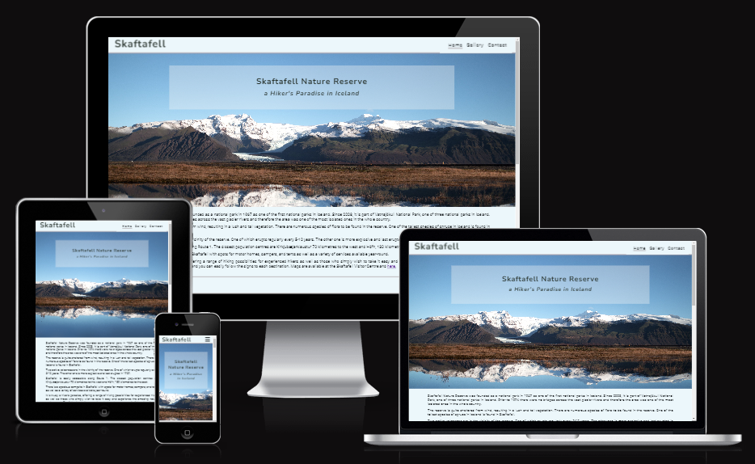

# Skaftafell

Skaftafell is a Nature Reserve located in the south-west of Iceland at the foot of the largest glacier in Europe, Vatnajökull. This website offers English speaking people, who are interested in hiking in Iceland, an overview of hiking trails in Skaftafell that are possible to hike without climbing gear with detailed trail descriptions, supported with images depicting the highlight of each hiking trail.

[View Skaftafell live project here](https://g-omarsdottir.github.io/skaftafell/)

## User Experience (UX)

### Key information
- A selection of hiking trails that do require neither experience nor climbing gear.
- Detailed trail descriptions supported by images of one of the highlights of each hiking trail and a map of the area.
- A selection of photographs from the area to give an impression of what the nature reserve has to offer.
- A contact form to allow users to ask questions about the nature reserve and the hiking trails, as well as contribute their own photographs to be displayed on the website.

### First time visitors goals
- To gather information about Skaftafell and its hiking trails.
- To be able to ask questions about the area, the level of difficulty of the trails, necessary equipment and clothing, the weather conditions, and possible dangers regarding hiking near to glaciers.
- To enjoy scenic photographs of the landscape.

### Returning visitors goals
- Check for new or updated trail descriptions.
- Review the photo gallery for any unseen photos or check if their own contributed photos have been included.

## Design

### Color Scheme
The primary color used as main background color was detected from the hero image and complementary colors were chosen for the color scheme. The following color palette displays the colors used for this website:

- #ECF7FB as primary background color
- #594E52 as footer background color
- #AC989D as decorative box-shadow
- #13181A as font color of body text element 
- #27322C as font color of heading elements
- #ECF7FB as font color for text elements in footer

### Color Contrast Check
Testing results of color contrast check for readability and web accessibility are as follows:

- #13181A as font color of body text elements: [Link to Coolors Color Contrast Checker report](https://coolors.co/contrast-checker/13181a-ecf7fb)

- #27322C as font color of heading elements: [Link to Coolors Color Contrast Checker report](https://coolors.co/contrast-checker/27322c-ecf7fb)

### Typography
- Roboto fonts were used for paragraphs.
- Nunita fonts were used for headers. 
- Fontawesome was used to create a visually clear, minimalistic content and to add a playful touch.

## Imagery
All images were used with the permission of the owners or by a purchased license. The owner is credited in the alternative text for each photo on the website’s gallery page as well as aria-labels on the homepage. All photographers are credited in the credit section. 

To keep structure and layout separated, the images on the homepage were applied using the CSS stylesheet. The attributes (Role=”img”) and “aria-label” were added. An alternative text was provided for all image elements instead of a title.

## Wireframes
Wireframes were created for desktops using the website [balsamiq](https://balsamiq.com/?gad_source=1&gclid=Cj0KCQiAtaOtBhCwARIsAN_x-3IqIhBtaldBdPKw1vdzHDLfNzwSUMhR0FZJWFcy9QNYXi6CTAbcnE4aAhhUEALw_wcB).

The mobile version of the website was developed first and gradually developed towards the wireframes for desktops. Screen sizes smaller than 320 were not considered in the design.

Homepage: 

Gallery page:

Contact page:

Thank-you-for-your-message page:

## Features

- The website is responsive on all device sizes.
- Visitors can navigate to homepage, gallery page and contact page using the navigation bar. 
- The Header of the website is linked to the homepage on the gallery page and the contact page. The link was removed from the header on the homepage since it is unnessecary and disturbed the reading flow when using screen readers.
- A pseudo-link:active was added to all links give users feedback in size and color when clicking the links.

### Existing Features

**Interactive elements**

- Navigation bar 
    - It is identical on all three pages, except that the location of the current page is indicated visibly with an underline, and as visibly hidden text for screen readers only.
    
    - Displayed a toggled drop-down menu on the mobile version:

    - Displayed in a row without toggle for the desktop version.

    - When actively clicked:

    - Allows easy navigation from page to page without using the reverse function of the web browser.

- A link to a PDF file of a map of the area on the homepage.
    - PDF file opens in a new tab.

- A contact form to send a message and option to upload and send images.
    - Contact form is visibly seperated with a decorative boarder.

### General Features of each page

**Homepage**

The homepage includes a brief introduction of the Skaftafell Nature Reserve with basic facts about history, geology, geography, flora, and facilities as well as a link to a map of the area. 

The hiking trail section offers an overview of hiking trails accessible without additional gear. Each trail contains a detailed description, indication of distance and duration, supported with an image depicting a viewpoint from the trail.

